# Demonstrate latest developments in Python to the application of machine learning to business related problems

Tjun Hoh

---

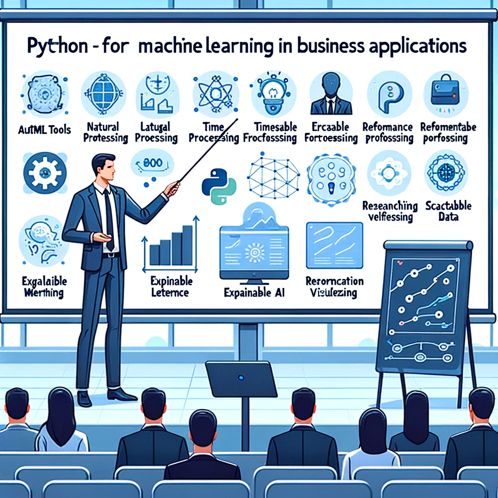
*DALL·E*

---

# Why Python?

---

# Python can do anything

*[xkcd #353](https://xkcd.com/353/)*

---

# Python pros and cons

* Semicolon-less
* Bootcamp-able, Medium-able
* ChatGPT-able, Github Copilot-able
* Libraries, libraries, libraries (have I already mentioned libraries?)
* APIs
* SDKs
* Cons: none

---

# Python is in demand

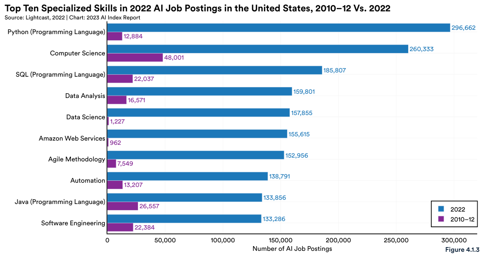
[*Artificial Intelligence Index Report 2023*](https://aiindex.stanford.edu/report/)

---

# ChatGPT can write Python

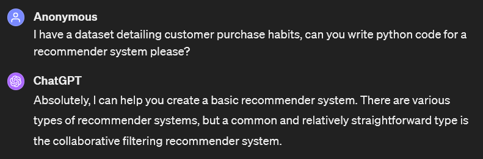
*[ChatGPT](https://chat.openai.com/share/a1afba74-fbd1-4681-9614-0e7a78ce94d7)*

---

# Python milestones

* Python 3.0 
    * > print("Hello world!") #A miracle!
* pandas / NumPy / SciPy / matplotlib
* scikit-learn / PyTorch / TensorFlow / Keras / LangChain
* Libraries, libraries, libraries
* Anaconda / Jupyter

---

# Machine learning?

---

# Statistics, ML, and AI 

- Classical statistics and machine learning
    * regression, classification, clustering
- Deep learning: 
    * neural networks, autoencoders, transformers
- Software paradigms: 
    * low-level libraries, high-level APIs
- Hardware paradigms: 
    * GPU computing, quantum computing

---

# Large language models

* ChatGPT
* Github Copilot
* Google Gemini
* Llama

---

# Communities / repositories

* HuggingFace
* Kaggle
* There's An AI For That
* arXiv

---

# ML pipeline

- End-to-end: 
    * Pandas &rarr; NumPy &rarr; scikit-learn &rarr; PyTorch / TensorFlow
- Automation (AutoML):
    * PyCaret, auto-sklearn, AutoKeras
- Interfacing with infrastructure:
    * Libraries, APIs, SDKs
    * SQLAlchemy, openai, AWS SDK for Python, Faust

---

# Machine learning is in demand

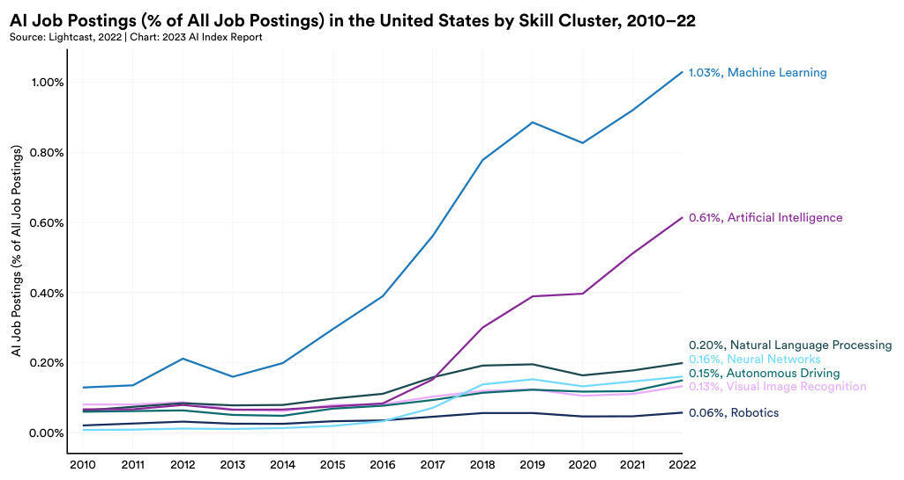
[*Artificial Intelligence Index Report 2023*](https://aiindex.stanford.edu/report/)

---

# Are we in business yet?

--- 

# Business operations

* Process analysis
* Waiting time analysis
* Supply chain management
* Quality management
* Demand forecasting
* Revenue management

---

# ML use-cases

* Predictive analytics / forecasting
* Recommender systems / clustering / NLP
* Decision theory / strategy
* Data visualisation
* Operations optimisation
* Network analysis
* Image processing

---

# ML use-case frequency

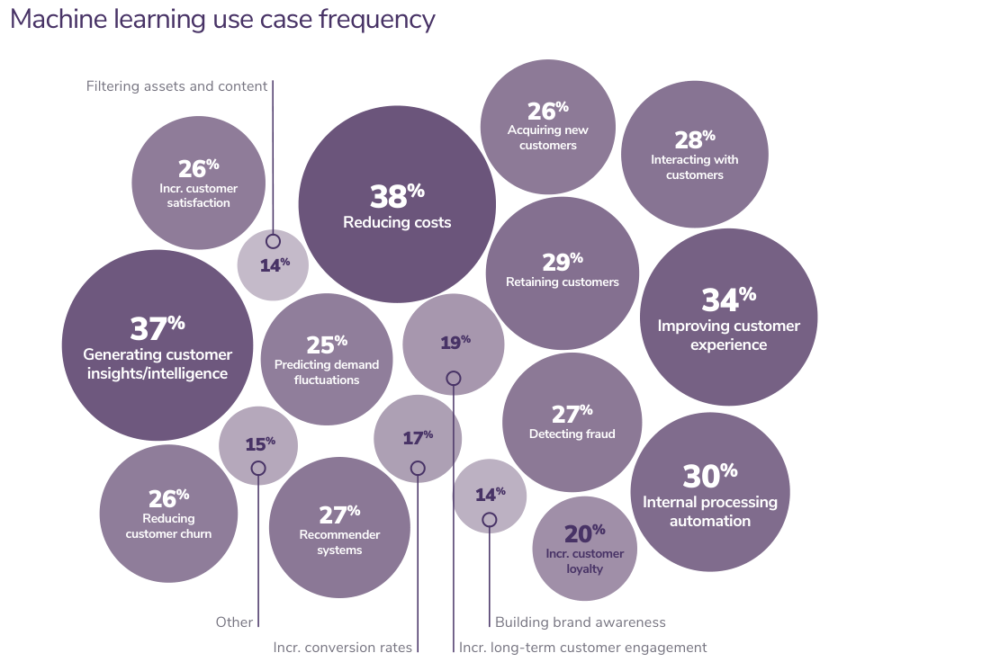
*2020 state of enterprise machine learning, Algorithmia*

---

# Use-case by size

* Large enterprise focus on internal applications:  
    * Cost-cutting, process automation, detecting fraud
* SME are customer-centric: 
    * Satisfaction, experience, insights, customer churn

---

# AI use-cases

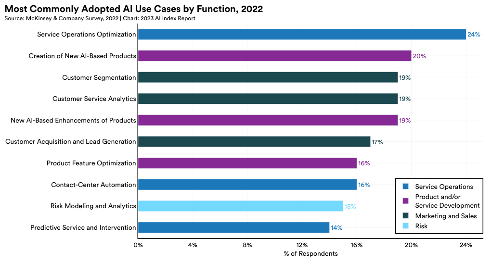
*[Artificial Intelligence Index Report 2023](https://aiindex.stanford.edu/report/)*

---

# Data mining

[*CRISP-DM, Wikipedia*](https://en.wikipedia.org/wiki/Cross-industry_standard_process_for_data_mining)

---

# Online ML

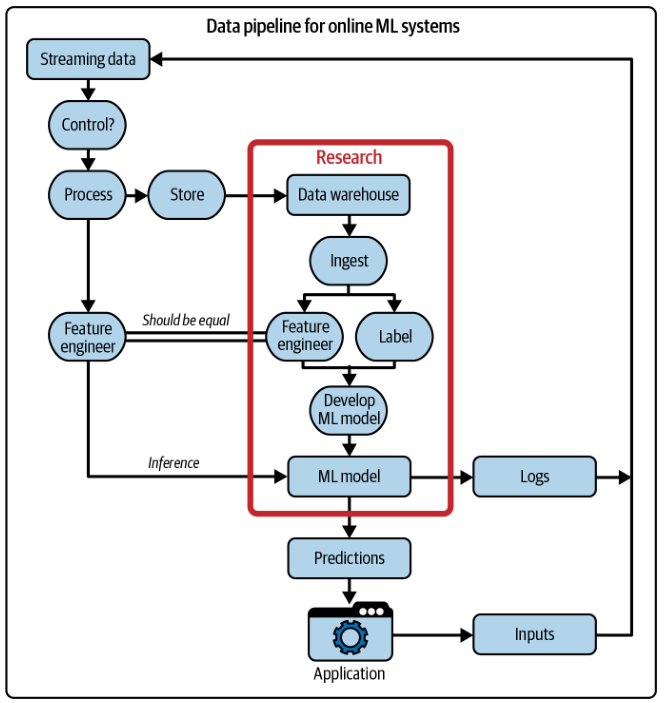
*Designing Machine Learning Systems*

---

# Roles and tools

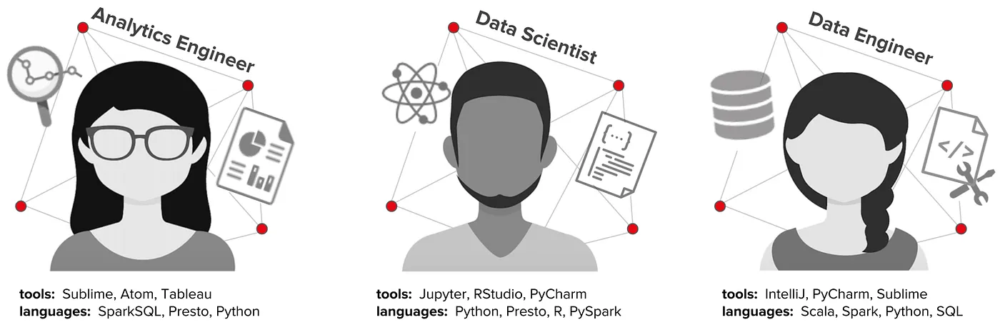
[*Netflix Technology Blog*](https://netflixtechblog.com/notebook-innovation-591ee3221233)

---

# Infrastructure

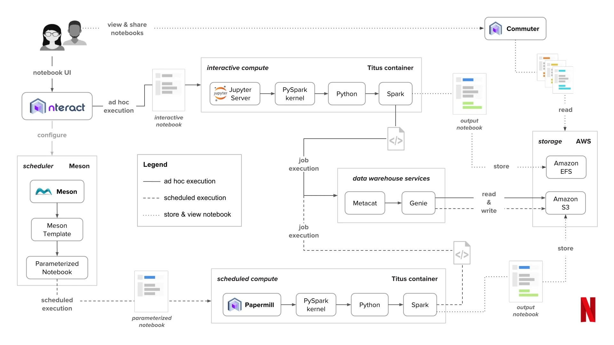
[*Netflix Technology Blog*](https://netflixtechblog.com/notebook-innovation-591ee3221233)

---

# Integration

* Database:
    * SQLAlchemy
* Cloud:
    * AWS SDK for Python
* Stream processing:
    * Faust vs. Apache Kafka / Spark / Storm / Samza / Flink
* GPU programming:
    * CUDA Python / PyCUDA / PyOpenCL

---

# Interactive prototyping

[*Jupyter*](https://jupyter.org/)

---

# Business intelligence and analytics

- Exploratory data analysis and visualisation
- Graphing libraries: 
    * Matplotlib, seaborn
- Web app frameworks: 
    * plotly, Dash, Flask
- Compatibility: 
    * Tableau, Power BI

---
# Business intelligence

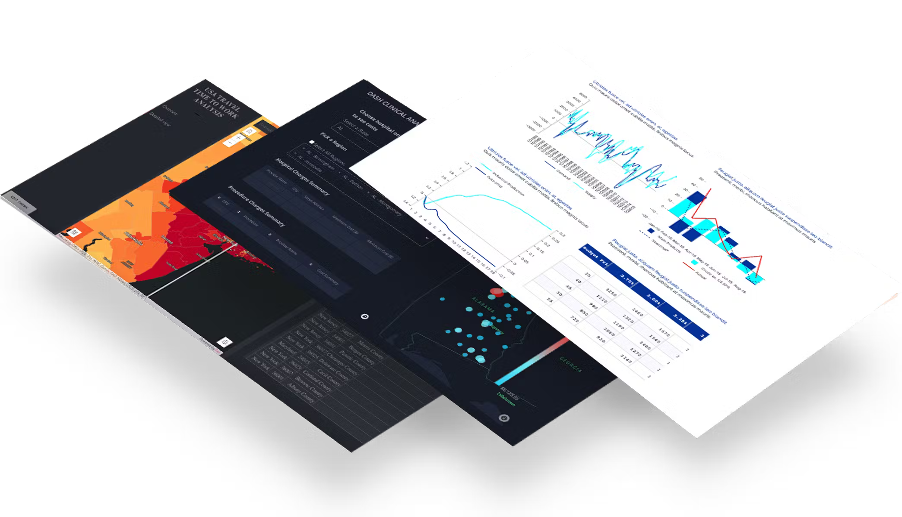
[*Dash*](https://plotly.com/examples/)

---

# Outsourcing and talent acquisition

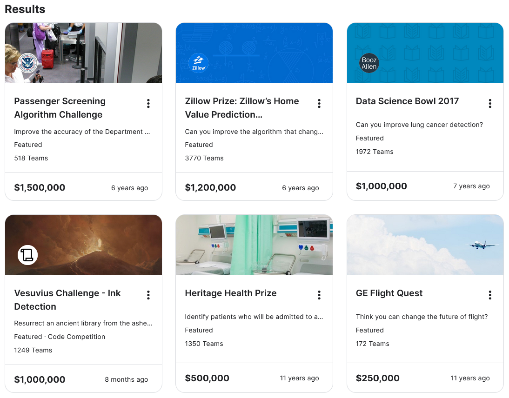
[*Kaggle*](https://www.kaggle.com/competitions?sortOption=reward/)

---

# Real-world ML systems

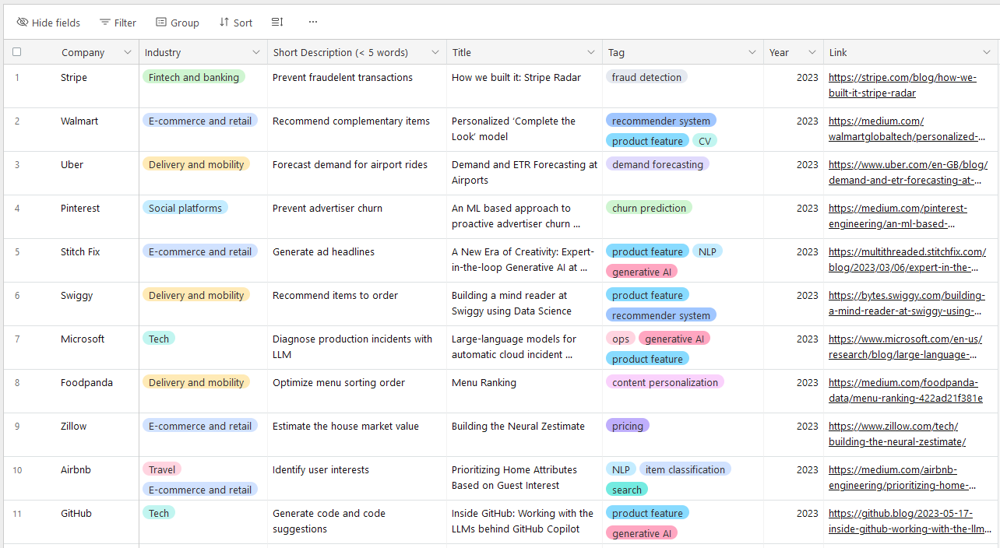
[*Evidently AI*](https://www.evidentlyai.com/ml-system-design)

---

### LLMs

* **UVdesk** &rarr; [Improving Customer Support: LangChain based Helpdesk & LLM-Powered AI Chatbot](https://www.uvdesk.com/en/blog/langchain-based-helpdesk-llm-powered-ai-chatbot/)
* **BlueLabel** &rarr; [AutoTweeter](https://www.bluelabellabs.com/blog/autotweeter-langchain-gpt4-ai-twitter-bot/)
* **Supply chain analytics** &rarr; [Leveraging LLMs with LangChain for Supply Chain Analytics](https://towardsdatascience.com/leveraging-llms-with-langchain-for-supply-chain-analytics-a-control-tower-powered-by-gpt-21e19b33b5f0)

### Automation

* **Google DeepMind** [Safety-first AI for autonomous data centre cooling and industrial control](https://deepmind.google/discover/blog/safety-first-ai-for-autonomous-data-centre-cooling-and-industrial-control/)

---

### Waiting time analysis

* **Delivery and ride-hailing platforms** &rarr; [DeeprETA: An ETA Post-processing System at Scale](https://arxiv.org/pdf/2206.02127.pdf)
    > Uber uses ETAs to calculate fares, estimate pickup times, match riders to drivers, plan deliveries, and more
* **Wayfair** &rarr; [Delivery-Date Prediction](https://www.aboutwayfair.com/careers/tech-blog/delivery-date-prediction)
    > what we had to do to cut the gap between promised and realized delivery times in half

---

### Predictive analytics

* **Zalando** &rarr; [Deep Learning Based Forecasting: A Case Study from the Online Fashion Industry](https://arxiv.org/pdf/2305.14406.pdf)
    > Demand forecasting in the online fashion industry is particularly amendable to global, data-driven forecasting models
* **IBM** &rarr; [Reinforcement Learning: The Business Use Case](https://medium.com/ibm-data-ai/reinforcement-learning-the-business-use-case-part-2-c175740999)
    > makes financial trades using the power of reinforcement learning

---

### Recommender systems

* **GrubHub** &rarr; [Online Learning for Recommendations at Grubhub](https://arxiv.org/abs/2107.07106)
    > up to a 45x cost savings and a +20% metrics increase
* **Etsy** &rarr; [How We Built a Multi-Task Canonical Ranker for Recommendations at Etsy](https://www.etsy.com/uk/codeascraft/how-we-built-a-multi-task-canonical-ranker-for-recommendations-at-etsy)
    > we provide buyers recommendations to help them find that one special item that stands out to them

---

### Fraud detection

* **BlaBlaCar** &rarr; [How we used machine learning to fight fraud at BlaBlaCar](https://medium.com/blablacar/how-we-used-machine-learning-to-fight-fraud-at-blablacar-part-1-3b976c9dcdf6)
    > BlaBlaCar has implemented various fraud detection and fraud management systems, some of which include machine learning algorithms
    
### Image recognition

* **Etsy** &rarr; [From Image Classification to Multitask Modeling: Building Etsy’s Search by Image Feature](https://www.etsy.com/codeascraft/from-image-classification-to-multitask-modeling-building-etsys-search-by-image-feature)
    > Searching by image is being rapidly adopted throughout the e-commerce industry

---

### Customer satisfaction

* **LinkedIn** &rarr; [Improving the customer’s experience via ML-driven payment routing](https://www.linkedin.com/blog/engineering/product-design/improving-the-customer-s-experience-via-ml-driven-payment-routin)
    > Our goal is to improve the subscription renewal member and customer experience by building and using an adaptive, ML-based, payment routing to replace the rule-based process. 
* **Dropbox** &rarr; [Optimizing payments with machine learning](https://dropbox.tech/machine-learning/optimizing-payments-with-machine-learning)
    > At Dropbox, we found that applying machine learning to our handling of customer payments has made us better at keeping subscribers happily humming along.

---

# Theoretical advancements

### New python libraries:
* [DataDreamer: A Tool for Synthetic Data Generation and Reproducible LLM Workflows](https://arxiv.org/abs/2402.10379)
* [Simplifying Hyperparameter Tuning in Online Machine Learning -- The spotRiverGUI](https://arxiv.org/abs/2402.11594)
* [MultiMedEval: A Benchmark and a Toolkit for Evaluating Medical Vision-Language Models](https://arxiv.org/abs/2402.09262)
* Et cetera

---

# The End?